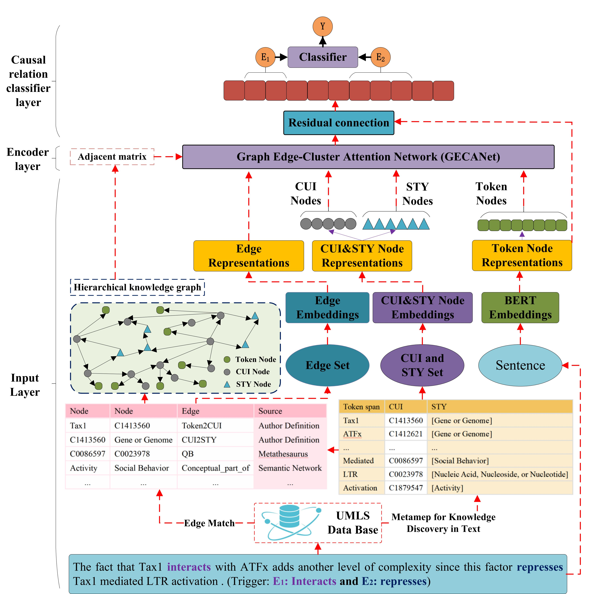
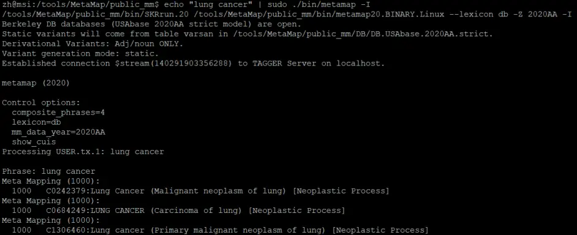

# Code of Paper: Biomedical Event Causal Relation Extraction Based on a Knowledge-Guided Hierarchical Graph Network
 


## Abstract

Biomedical Event Causal Relation Extraction (BECRE) is a challenging task in biological information extraction, and plays a crucial role to serve for knowledge base and knowledge graph construction. Here a biomedical cause-effect relation is defined as an association between two events and requires that the cause-event must occur before the effect-event. Some current advances tend to apply deep learning for the BECRE task and have achieved comparable performances. However, because most of event causal relations are implicitly stated, the performances of these works based on contextual semantics and syntactics might be limited. This fact suggests that it is necessary to introduce external cues to improve the performance of the implicit BECRE especially in the low source scenario. To improve the potential of the designed model, an intuitive idea is to introduce hierarchical knowledge from biological knowledge base to supplement domain cues for the contexts. Nevertheless, it is difficult to learn the hierarchy and cause-effect direction of knowledge in the model and also few works focus on this issue. Thus, to better fuse knowledge, we propose a Graph Edge-Cluster Attention Network (GECANet) for the BECRE task. Specifically, we introduce external knowledge and build hierarchical knowledge graphs for the contexts. Also, the proposed GECANet effectively aggregates the context and hierarchical knowledge semantics under the guidance of cause-effect direction. The experimental results confirm that fusing external knowledge can effectively guide model to identify event causal relation and facilitate our approach to achieve state-of-the-art performances respectively on the Hpowell and BioCause datasets.

## 1. Enviroments
### 1.1 Main Packages

python=3.8.10

torch=1.10.0+cu113

transformers=3.0.1

scispacy=0.4.0

spacy=3.0.7

dgl=1.0.1+cu113

### 1.2 Hardware

CPU: 12 vCPU Intel(R) Xeon(R) Platinum 8255C CPU @ 2.50GHz

GPU: RTX 3090(24GB) * 1

### 1.3 Sources of Data 

Hpowell: https://github.com/myedibleenso/this-before-that \
Biocause: http://www.nactem.ac.uk/biocause/

## 2. Preprocess for datasets

### 2.1 Knowledge Discovery from context using UMLS

Note: you should download UMLS (our version: 2020AA) knowledge base from website: https://www.nlm.nih.gov/research/umls/licensedcontent/umlsknowledgesources.html

According to guidance of installation in UMLS, you need to install UMLS and obtain the files including:

"2020AA\META\MRCONSO.RRF", 

"2020AA\META\MRREL.RRF", 

"2020AA\NET\SRSTR".

In addition, you alson need install Metamap tool based on Java 8 (a knowledge mining tool depending on UMLS). If you install UMLS successfully, you can input some commands in terminal (linux) and find:



#### 2.1.1 The conversion of format from BioNLP to normalization (denotes Biocause dataset) 

**>> preprocessing Biocause**

**Please see “datasets/biocause/preprocess”**

python preprocess-step-1.py

python preprocess-step-2.py

Note: the format conversion of Biocause refer to the project:  https://github.com/cosbi-research/beesl

***Based on the above scripts, we can obtain the unified format with Hpowell dataset.***

**>> The standard format conversion**

**Please See the files in the Path: knowledge/umls_map/**

python standard-step-1.py -task_name task_name

#### 2.1.2 The two methods of knowledge discovery based on UMLS

Here we test two kinds of approaches of knowledge discovery based on UNLS. One is to utilize the UMLSLinker in the ensemble tool  ***Scispacy***. Another one is to self-defined script depending on the terminal (see above fig)

First one: python entitylinker-step-1s -task_name task_name

Second one: python entitylinker-step-1 -task_name task_name (better)

### 2.2 Extracting Triplets of CUIs and STYs in Metathesaurus and Semantic Network

python umlsbase-step-2 -task_name task_name

("2020AA\META\MRCONSO.RRF", "2020AA\META\MRREL.RRF", "2020AA\NET\SRSTR") are too large. You'd better to have a PC with 32G memory.

### 2.3 Constructing the Hierarchical Knowledge Graph

python umlsgraph-step-3.py -task_name task_name

Note: This graph including the Token, CUI, and STY nodes. This fact means that the number of nodes is greater than the number of tokens, which is very different with the traditional dependency knowledge

### 2.4/5 Generating Triplets of Knowledge and Train Graph Embeddings of CUIs and STYs 

python triplets-step-4.py -task_name task_name

python train_kg-step-5.py -task_name task_name

Note: This process depends on a tool called ***openke**. The detailed guidance can be found in: https://github.com/thunlp/OpenKE.

Also, the construction of graph refer to the project: \
https://github.com/PlusLabNLP/GEANet-BioMed-Event-Extraction

### 2.6 Converting the Scalable Graph into a Tensor Graph and Generating the Input Data 

python spacy-step-6.py -task_name task_name

## 3 Training and Evaluating Model

```
python BCREPipeLine.py --epoch 50
                       --data_path ./datasets/hpowell/std_data/BCRE-KG-data.pkl 
                       --TransE_dir ./datasets/knowledge/kge_embed/UMLS_CUI_STY_tmp_biocause_transe_margin_d300_adam-0.5_t1000.ckpt \
                       --task_name biocause 
                       --bert_path monologg/biobert_v1.1_pubmed 
                       --train_batch_size 4 
                       --drop_rate 0.5 
                       --lr 5e-5 
                       --warm_up_proportion 0.0 
                       --bert_name BioBERT4
                       --early_stop 20 
                       --seed 0 
                       --using_GNN_type GECANet 
                       --using_node True 
                       --using_edge True 
                       --using_att True 
                       --using_dr True 
                       --dr_dim 300 
                       --kg_embedding_frozen False 
                       --GNN_n_layer 5 
                       --sampling normal
```


